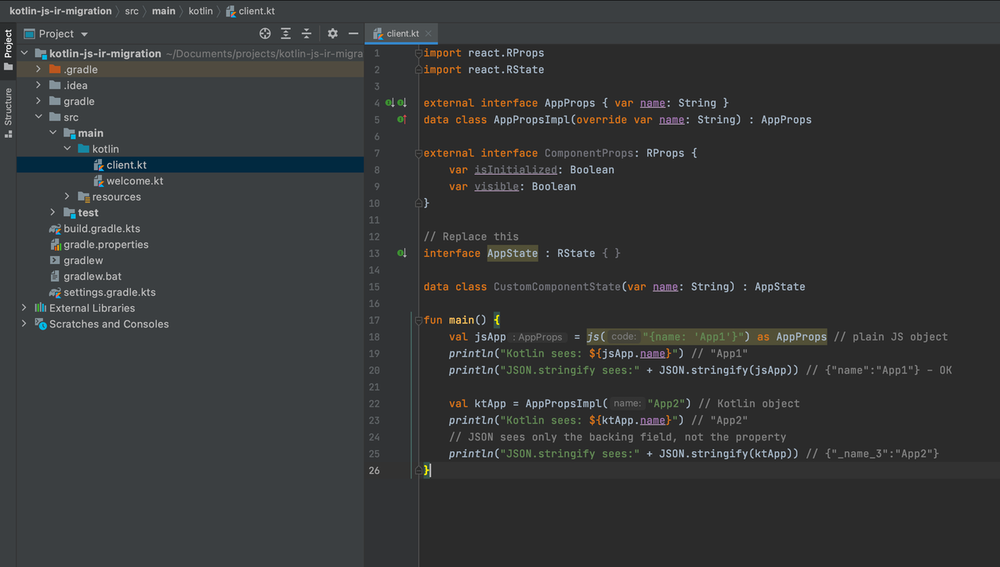

# Kotlin/JS Inspection Pack

This plugin adds useful inspections, intentions, and quick-fixes for working with Kotlin/JS projects. It provides
helpful functionality when you’re building new applications using Kotlin/JS, and it helps you migrate existing
applications to the [Kotlin/JS IR compiler](https://kotlinlang.org/docs/js-ir-compiler.html).

The following features are available with this plugin:

* Convert JS and React-related classes and interfaces to external interfaces

Using Kotlin interfaces and classes (including data classes) that derive from pure JS classes, such as React's `RState`
and `RProps`, can cause `ClassCastExceptions`. This plugin allows you to convert such classes and interfaces to external
interfaces.

* Convert properties of external interfaces to var

Properties of [external interfaces](https://kotlinlang.org/docs/js-interop.html#external-interfaces) in Kotlin/JS code
can't be read-only (val) properties.

The plugin contains a quick-fix that allows you to convert the read-only properties of an external interface into
mutable var properties.

* Make boolean properties nullable in external interfaces

In JavaScript, a boolean variable can be null or undefined. Kotlin requires you to explicitly specify the nullability of
boolean variables in external interfaces to prevent ClassCastExceptions.

Now there is an inspection that will highlight boolean properties in external interfaces and offer to make them
nullable (`Boolean?`).

* Convert functions with receivers in external interfaces to regular functions

External declarations can't contain functions with receivers, such as extension functions or properties with corresponding functional types.
This plugin allows you to convert such functions and properties into regular functions by moving the receiver object to an argument.

## Feedback

If you encounter any issues with the inspections in the plugin, please report them in our issue
[tracker](https://youtrack.jetbrains.com/newIssue?project=kt&draftId=25-3384480). For problems with Kotlin/JS, please
report them by submitting a ticket in the official Kotlin YouTrack.

## Further reading

Take a look at this additional information on
the [new Kotlin/JS IR backend](https://kotlinlang.org/docs/js-ir-compiler.html), and read the [Kotlin/JS IR migration
guide](https://kotlinlang.org/docs/js-ir-migration.html#convert-js-and-react-related-classes-and-interfaces-to-external-interfaces).
